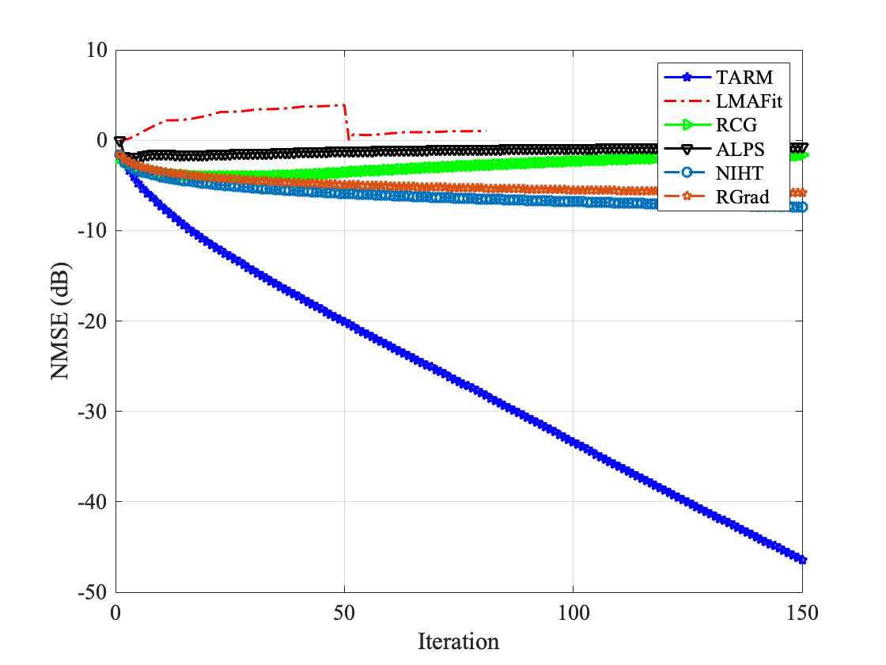
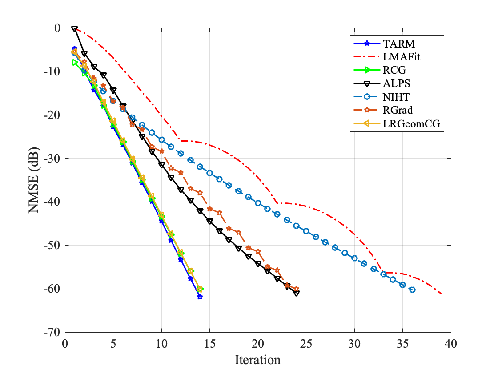

# TARM: A turbo-type algorithm for affine rank minimization

This repository contains the implementation of the **TARM: A turbo-type algorithm for affine rank minimization** algorithm proposed in the paper:

> Z. Xue, X. Yuan, J. Ma, and Y. Ma, "TARM: A turbo-type algorithm for affine rank minimization." *IEEE Transactions on Signal Processing* no. 22, vol. 67, Nov. 2019. doi: [10.1109/TSP.2019.2944740](https://doi.org/10.1109/TSP.2019.2944740)

## Introduction

Turbo-type Affine Rank Minimization (TARM) algorithm is proposed for affine rank minimization problems including low-rank matrix recovery and matrix completion problem.

## Code Structure

`TARM.m`: Turbo-type affine rank minimization algorithm

- Input parameters
  - `b`: measurement vector
  - `A`: linear operator, here we implement it as a linear opeartor
  - `At`: adjoint linear operator of `A`
  - `r`: rank of the low-rank matrix
  - `params`: other parameters for recovery
  - `errorfunction`: evaluation function

`NIHT.m`: Normalized Iterative hard thresholding algrotihm

`RCG.m`: Riemannian Conjugate Gradient Descent algorithm

`RGrad.m`: Riemannian Gradient Descent algorithm

`singular.m`: the impact of distributions of singular values of low-rank matrix on the performance of TARM recovery

`lr_comp.m`: comparisons of the performance of different algorithms on the low-rank matrix recovery with linear operator `A` set as the right orthogonally invariant linear operator

`lr_comp.m`: comparisons of the performance of different algorithms on the matrix completion problem

`put_vector.m`: utility function that set the values of the indexed positions of a vector as the given values

`./LMaFit_adp`: this folder includes the code of the low-rank matrix fitting (LMaFit) algorithm

`./LRGeomCG`: this folder includes the matlab code of the LRGeomCG algorithm

## Citation

```
@ARTICLE{8855028,
  author={Z. {Xue} and X. {Yuan} and J. {Ma} and Y. {Ma}},
  journal={IEEE Transactions on Signal Processing}, 
  title={TARM: A Turbo-Type Algorithm for Affine Rank Minimization}, 
  year={2019},
  volume={67},
  number={22},
  pages={5730-5745},
  doi={10.1109/TSP.2019.2944740}}
```


## Test Result

Run `lr_comp.m` and set the comparison parameters to the settings in fig4 (bottom-right) of the paper, you will get the following result:



Run `mc_comp.m` and set the comparison parameters to the settings in fig9 (middle) of the paper, you will get the following result:

